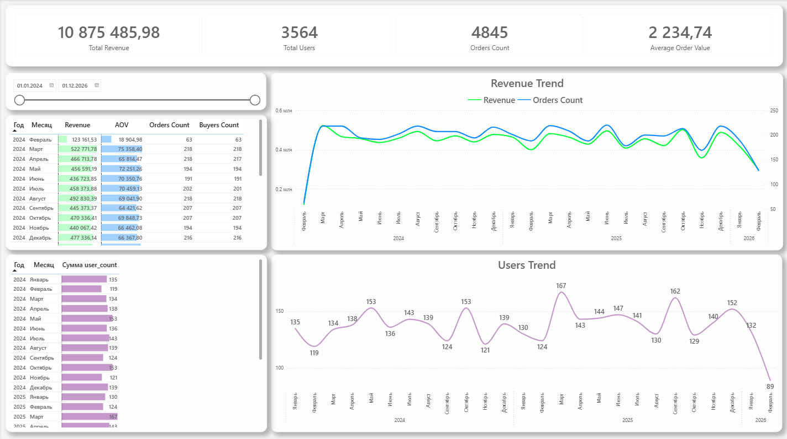
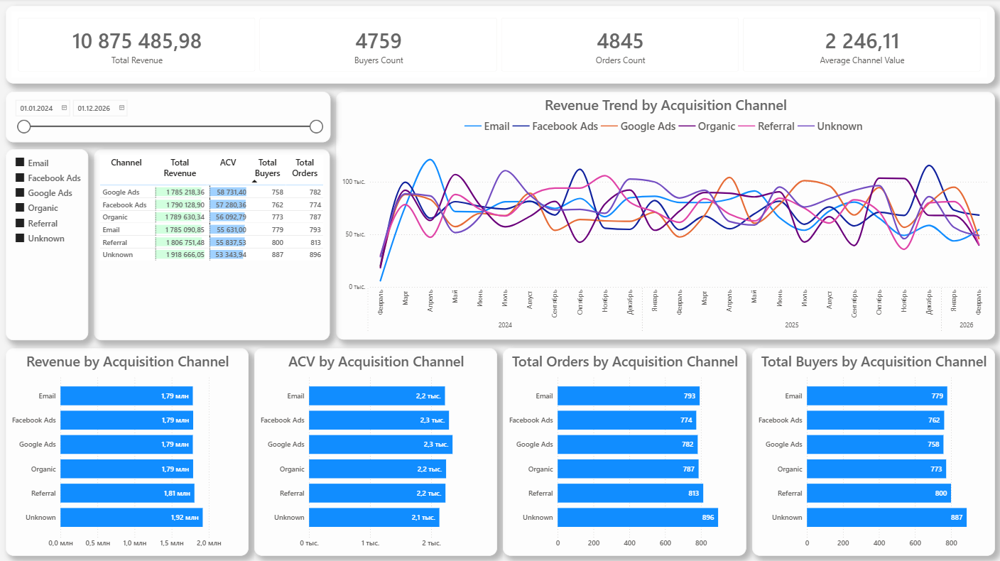
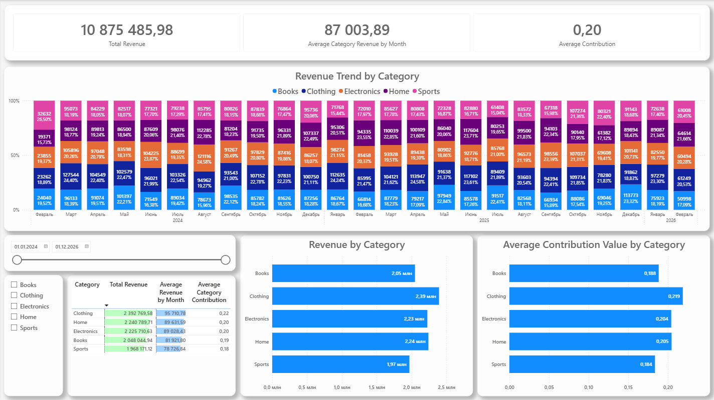
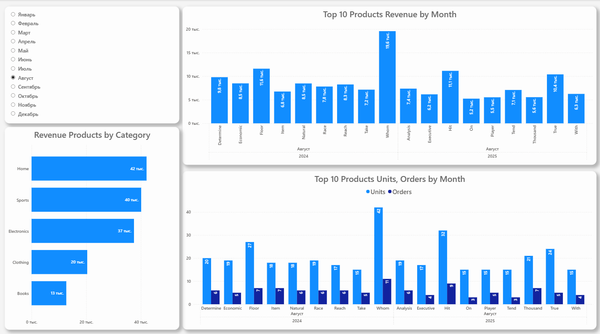
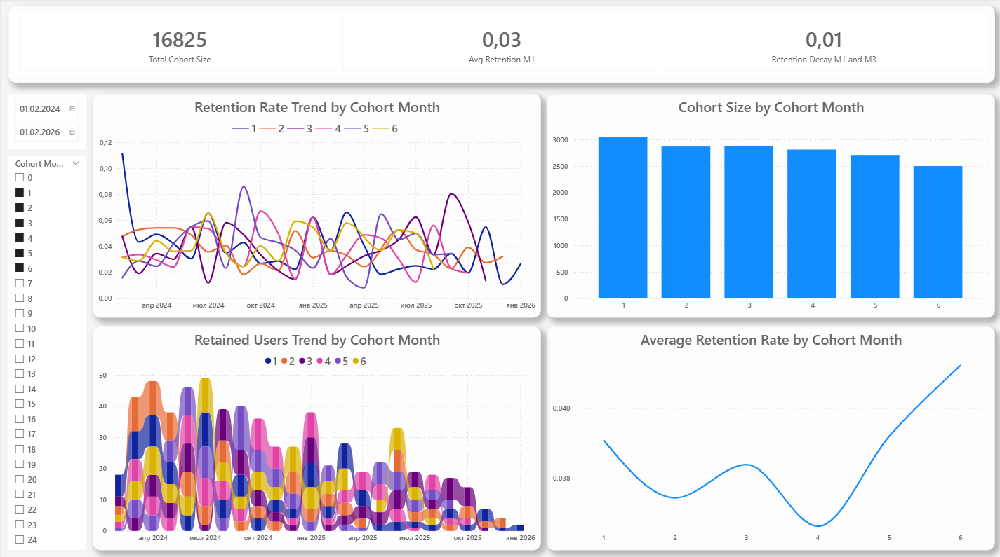

# Ecommerce Analytics Project (PostgreSQL + Power BI)

## Project Overview
This project analyzes the effectiveness of e-commerce using **PostgreSQL** and a visualized dashboard in **Power BI**.

---

## Final Dashboard

### Revenue Trend and Users Growth

  

### Revenue by Channel

  

### Revenue by Category

  

### Top Products

  

### Cohort Retention Analysis

  

---

## Business Questions Answered

### How is revenue changing over time?
- Monthly revenue trends
- Growth and decline periods

### Which channels generate the most revenue?
- Revenue breakdown by acquisition channel
- Identification of most profitable channels

### Which products generate the most revenue?
- Top-performing products
- Product performance comparison

### How do customers retain over time?
- Cohort retention analysis
- Customer lifecycle tracking

### Which categories contribute most to revenue?
- Revenue contribution by product category

---

### Raw Layer
Original unprocessed data:
- `users_raw.csv`
- `orders_raw.csv`
- `order_items_raw.csv`
- `products_raw.csv`

### Staging Layer
Cleaned and standardized tables:
- `staging_users`
- `staging_orders`
- `staging_order_items`
- `staging_products`

### Mart Layer (Star Schema)
Optimized analytics model:

**Dimension Tables:**
- `dim_users`
- `dim_products`

**Fact Tables:**
- `fact_orders`
- `fact_order_items`

### Analytical Views
Precomputed views used for reporting:
- Revenue trend by month
- Revenue by channel
- Cohort retention
- Top products
- Category contribution
- User KPIs

---

## KPIs Implemented
Key business metrics calculated in SQL and visualized in Power BI:
- **Total Revenue** = SUM(order revenue)
- **Total Orders** = COUNT(DISTINCT order_id)
- **Total Users** = COUNT(DISTINCT user_id)
- **Average Order Value (AOV)** = Revenue / Orders
- **Revenue by Channel**
- **Revenue by Category**
- **Top Products by Revenue**
- **Customer Retention Rate**
- **Cohort Retention**